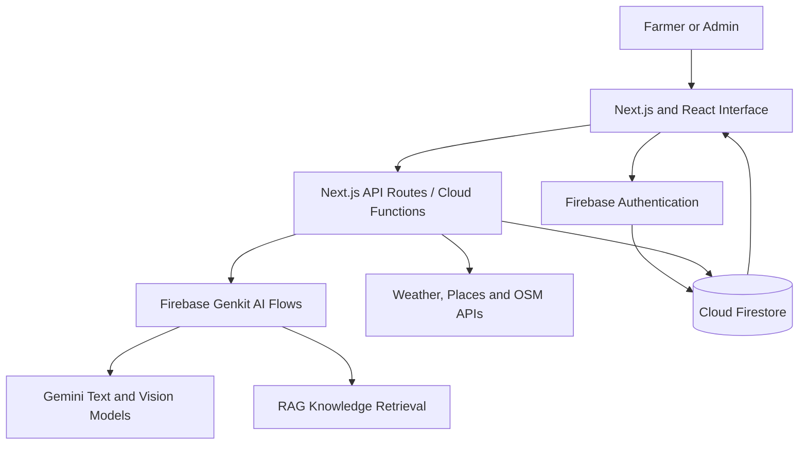

[README.md](https://github.com/user-attachments/files/33026464/README.md)
# 🌾 AgriGuard — AI-Powered Agriculture Assistant

[](https://nextjs.org/)
[](https://react.dev/)
[](https://www.typescriptlang.org/)
[](https://firebase.google.com/)
[](https://ai.google.dev/)
[](https://agri-guard-tau.vercel.app/)
[](LICENSE)

**AgriGuard** is a mobile-first agricultural decision-support web application built for farmers. It combines crop-image analysis, symptom-based AI assistance, treatment guidance, weather intelligence, field monitoring, notifications, and agricultural marketplace discovery in one system.

> **Live application:** [https://agri-guard-tau.vercel.app/](https://agri-guard-tau.vercel.app/)

> **Important:** AgriGuard provides AI-assisted guidance. It is not a replacement for laboratory testing, an agronomist, or official pesticide instructions.

---

## 📌 Table of Contents

- [Problem](#-problem)
- [Solution](#-solution)
- [Main Features](#-main-features)
- [How It Works](#-how-it-works)
- [System Architecture](#️-system-architecture)
- [Technology Stack](#️-technology-stack)
- [Getting Started](#-getting-started)
- [Environment Variables](#-environment-variables)
- [Available Scripts](#-available-scripts)
- [Project Structure](#-project-structure)
- [Safety and Limitations](#️-safety-and-limitations)
- [Future Improvements](#-future-improvements)
- [Project Team](#-project-team)
- [License](#-license)

---

## 🎯 Problem

Farmers may face crop loss because diseases are noticed late, agricultural experts are not always available nearby, changing weather increases crop risk, and trusted suppliers or services can be difficult to find.

## 💡 Solution

AgriGuard gives farmers one simple platform where they can:

- Upload a crop image and describe visible symptoms.
- Receive an AI-assisted disease assessment.
- View confidence, severity, affected parts, and suspected affected areas.
- Follow treatment, safety, prevention, and recovery guidance.
- Connect reports with a field or plot for long-term monitoring.
- Receive crop-aware weather advice and notifications.
- Discover agricultural suppliers, buyers, and logistics services.

---

## ✨ Main Features

### 🔐 Authentication and Farmer Profile

- Firebase phone-number authentication using OTP and reCAPTCHA.
- Farmer profile with name, location, crops, language, and notification preferences.
- English and Urdu interface support.

### 📸 AI-Assisted Crop Diagnosis

- Crop image upload with farmer-provided symptoms.
- Automatic crop detection or manual crop selection.
- Support for Wheat, Cotton, Rice, Sugarcane, Maize, Apple, Mango, and Citrus.
- Non-plant image rejection.
- Disease name, confidence, severity, affected parts, and description.
- Suspected affected-area highlights with explanations.
- Expert-review indicator for uncertain or serious cases.
- Retry option for failed or pending diagnoses.

### 💊 Treatment and Recovery Guidance

- Step-by-step treatment recommendations.
- Suggested materials, timing, safety notes, and estimated PKR cost.
- Disease-prevention recommendations.
- Four-week protection and recovery plan.
- Treatment progress tracking.

### 🌱 Field and Report History

- Save diagnosis reports in Firestore.
- Link a diagnosis with a farmer's field or plot.
- View recent reports and field-related history.
- Compare available report information and monitor recovery progress.

### 🌦️ Weather Intelligence

- Current and forecast weather information.
- Crop-aware weather-risk analysis and recommendations.
- Cached or fallback handling when the live service is unavailable.

### 🛒 Agricultural Marketplace

- Search and filter agricultural suppliers, buyers, and logistics providers.
- Google Places integration with OpenStreetMap-based fallback.
- Location-aware discovery using browser geolocation and map services.

### 🔔 Notifications

- Weather alerts.
- Disease warnings.
- Treatment reminders.
- Marketplace updates.
- Diagnosis-completion notifications.

### 📊 Dashboard and Administration

- Farmer dashboard with statistics, recent reports, and quick actions.
- Admin metrics for reports, users, average confidence, and response time.
- Seven-day activity chart.
- AI-agent activity logs with action, report ID, status, duration, and timestamp.

---

## 🔄 How It Works

1. The farmer signs in using phone OTP.
2. The farmer uploads a crop image and enters symptoms.
3. The application validates the input and rejects unsuitable images.
4. Firebase Genkit prepares and manages the AI workflow.
5. Gemini Vision analyzes the image together with the symptoms.
6. Relevant knowledge is retrieved using RAG and vector-similarity retrieval.
7. Gemini produces structured diagnosis and treatment information.
8. The application validates and displays the result.
9. Firestore stores the report, plan, status, timestamps, and field link.
10. Weather, notifications, marketplace discovery, and follow-up tools support the farmer after diagnosis.

---

## 🏗️ System Architecture



### AI Components

| Component | Role in AgriGuard |
|---|---|
| **Gemini 2.0 Flash Vision** | Analyzes crop images together with symptoms. |
| **Gemini Pro** | Produces text-based reasoning and structured guidance. |
| **Firebase Genkit** | Organizes prompts, model calls, AI flows, and structured responses. |
| **RAG** | Retrieves relevant project knowledge before the AI generates guidance. |
| **Vector similarity** | Finds knowledge entries that are most relevant to the current crop and symptoms. |

AgriGuard integrates pre-trained Gemini models. It does **not** claim to train a custom CNN or foundation model.

---

## 🛠️ Technology Stack

| Area | Technologies |
|---|---|
| **Frontend** | Next.js 15, React 18, TypeScript 5 |
| **Styling and UI** | Tailwind CSS 3, shadcn/ui, Radix UI, Lucide icons |
| **AI** | Firebase Genkit, Google Gemini Pro, Gemini 2.0 Flash Vision, RAG |
| **Backend** | Next.js API Routes, Firebase Cloud Functions, Node.js 20 |
| **Database** | Firebase Firestore (real-time NoSQL database) |
| **Authentication** | Firebase Authentication, phone OTP, reCAPTCHA |
| **Maps and Marketplace** | Google Places API, OpenStreetMap Overpass API, Nominatim |
| **Weather** | OpenWeatherMap API |
| **Notifications** | Firestore notification records and browser/FCM infrastructure |
| **Charts** | Recharts |
| **Language** | i18next and react-i18next |
| **Validation** | Zod and React Hook Form |
| **Deployment** | Vercel |

---

## 🚀 Getting Started

### Prerequisites

- [Node.js 20 or later](https://nodejs.org/)
- npm
- A Firebase project
- A Google Gemini API key
- An OpenWeatherMap API key
- A Google Places API key for live marketplace results

### Installation

1. Clone the repository:

   ```bash
   git clone <your-repository-url>
   cd AgriGuard--main
   ```

2. Install dependencies:

   ```bash
   npm install
   ```

3. Create a `.env.local` file in the project root and add the required configuration shown below.

4. Start the development server:

   ```bash
   npm run dev
   ```

5. Open [http://localhost:9002](http://localhost:9002).

### Run Genkit Developer Tools

In a separate terminal, run:

```bash
npm run genkit:dev
```

For automatic reload during AI-flow development:

```bash
npm run genkit:watch
```

---

## 🔑 Environment Variables

Create `.env.local` and add your own values:

```env
# Firebase client configuration
NEXT_PUBLIC_FIREBASE_API_KEY=
NEXT_PUBLIC_FIREBASE_AUTH_DOMAIN=
NEXT_PUBLIC_FIREBASE_PROJECT_ID=
NEXT_PUBLIC_FIREBASE_STORAGE_BUCKET=
NEXT_PUBLIC_FIREBASE_MESSAGING_SENDER_ID=
NEXT_PUBLIC_FIREBASE_APP_ID=
NEXT_PUBLIC_FIREBASE_MEASUREMENT_ID=

# Gemini / Genkit
GEMINI_API_KEY=
# The AI configuration also supports GOOGLE_GENAI_API_KEY or GOOGLE_API_KEY.

# Weather
OPENWEATHERMAP_API_KEY=

# Marketplace / Google Places
NEXT_PUBLIC_GOOGLE_PLACES_API_KEY=

# Browser notifications
NEXT_PUBLIC_VAPID_KEY=

# Firebase Admin — required by protected server-side coordinator features
FIREBASE_PROJECT_ID=
FIREBASE_CLIENT_EMAIL=
FIREBASE_PRIVATE_KEY=
```

Never commit `.env.local`, Firebase private keys, or production credentials to GitHub.

---

## 📜 Available Scripts

| Command | Purpose |
|---|---|
| `npm run dev` | Starts the Next.js development server on port `9002`. |
| `npm run genkit:dev` | Starts the Genkit development environment. |
| `npm run genkit:watch` | Starts Genkit in watch mode. |
| `npm run build` | Creates a production build. |
| `npm run start` | Runs the production Next.js server. |
| `npm run typecheck` | Checks TypeScript without creating output files. |

Before deployment, run:

```bash
npm run typecheck
npm run build
```

---

## 📁 Project Structure

```text
AgriGuard--main/
├── functions/                 # Firebase Cloud Functions
├── public/                    # Static files and knowledge resources
├── src/
│   ├── ai/
│   │   ├── flows/             # Diagnosis, treatment, weather and marketplace AI flows
│   │   └── genkit.ts          # Genkit and Gemini configuration
│   ├── app/
│   │   ├── (app)/             # Authenticated dashboard, reports, fields and admin pages
│   │   ├── api/               # Next.js API routes
│   │   ├── login/             # Phone OTP login
│   │   └── page.tsx           # Public landing page
│   ├── components/            # Reusable interface components
│   ├── firebase/              # Firebase providers and integration
│   └── lib/                   # Firestore, notifications and service helpers
├── package.json
└── README.md
```

---

## 🛡️ Safety and Limitations

- AI results can be incorrect, especially with unclear images or uncommon local disease patterns.
- Confidence is not the same as scientifically measured accuracy.
- Severe, unusual, or low-confidence cases should be reviewed by an agricultural expert.
- Treatment recommendations must be checked against local regulations and official product labels.
- Scientific accuracy requires evaluation on a labeled and locally representative test dataset.
- Third-party weather, map, and AI services may be delayed or temporarily unavailable.

---

## 🔮 Future Improvements

- Evaluation using a labeled Pakistani crop-disease dataset.
- Agronomist-reviewed disease and treatment knowledge.
- Five-year crop history with before-treatment and recovered-crop images.
- Severity-based historical comparison and long-term recovery analytics.
- Offline/PWA support for low-connectivity areas.
- Voice assistance in Urdu and regional languages.
- Stronger marketplace transactions and verified service providers.
- IoT sensor, drone, and satellite-data integration.

---

## 👩‍💻 Project Team

| Member | Registration Number | Program |
|---|---|---|
| **Ayesha Shafiq** | 2022F-MULBSSWE-005 | BS Software Engineering |
| **Amna Kashif** | 2022F-MULBSSWE-028 | BS Software Engineering |

Developed as a Final Year Project at the **School of Software Engineering, Minhaj University Lahore**.

---

## 📄 License

This project is licensed under the [MIT License](LICENSE).

---

<p align="center">
  Built with 🌱 for smarter and safer agriculture.
</p>
